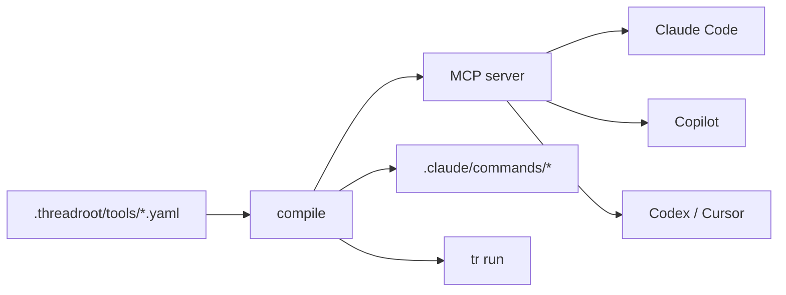
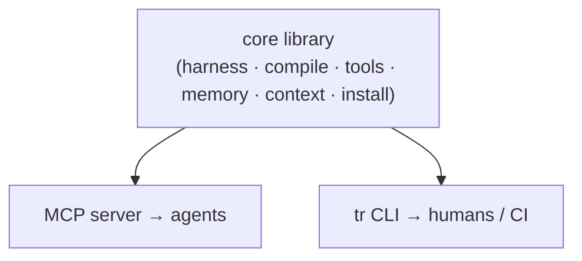

# Threadroot v1 — Specification

> **One-sentence summary:** Threadroot is git for your AI agent harness — a vendor-neutral, version-controlled home in your repo for the instructions, memory, skills, and executable tools your agents use, with a git-style CLI any agent can run (and an MCP server any agent can call), so your AI setup lives with the project instead of being trapped in one IDE.

## 1. Thesis & goals

**The pain we kill:** developers run multiple agent subscriptions (Codex, Claude Code, Copilot, Cursor). When usage caps hit, they switch platforms mid-task — and lose their context and have to reformat their agent files (`AGENTS.md` → `CLAUDE.md` → `.cursor/rules` → …). Context is trapped at the IDE/vendor level.

**What we make:** the canonical, git-tracked source of truth for an agent's whole operating environment ("the harness"), which **compiles to every vendor format** and is **callable by any agent over MCP**.

### v1 must prove (the demo)
1. **One source → every agent format** (kills the reformat pain — the wedge).
2. **Tools callable from any agent via MCP** (the differentiator).
3. **A harness you can `install` from a git URL** (the moat seed).

### Non-goals for v1
- Hosted/central registry (git URLs suffice; format is shareable day one).
- Sandboxed tool execution (local trust model = npm scripts).
- Fullscreen TUI (removed; agent-first CLI).
- LLM reasoning inside threadroot (that is the user's agent's job, over MCP).
- Adapters beyond the big four (fast-follow once the adapter framework exists).
- Web dashboard, analytics, merge-conflict UI.

## 2. Locked decisions (from alignment)

| Decision | Choice |
|---|---|
| Build approach | Reshape existing code; add new core packages where needed; reuse only what we need |
| Compile direction | **Import once at `init`, then one-way** (canonical → vendor) |
| v1 adapters | AGENTS.md, CLAUDE.md (+ commands), Copilot, Cursor |
| Tool execution | Shell command OR script file, **run locally, no sandbox**, confirm-flag + allow-list |
| Object format | Markdown + YAML frontmatter (prose); pure YAML (tools); validated with zod |
| Interface | Shared **core library** exposed equally via **MCP** (agents) and **`tr` CLI** (humans/CI) |
| Backward compat | Clean break (no users yet) |
| Monetization | Pure OSS v1; leave source-interface, auth-hook, provenance-log seams |
| Memory | Structured 5-type set, **task-scoped at compile, size-budgeted, recency/commit-tied** |

## 3. Object model — "the harness"

Five object types. Everything in the product is one of these.

| Object | What it is | Scope | Format |
|---|---|---|---|
| **Instructions** | Rules / conventions / persona | user · project · path | `AGENTS.md` + `rules/*.md` |
| **Memory** | Durable facts, decisions, handoff | user · project | `memory/*.md` |
| **Skills** | Procedural how-tos (progressive disclosure) | user · project | `skills/*.md` |
| **Tools** | Executable commands w/ schema | user · project | `tools/*.yaml` |
| **Adapters** | Compile targets + MCP wiring | project | `harness.yaml` |

## 4. File layout

```
repo/
├── AGENTS.md                       # canonical prose instructions (the open standard)
└── .threadroot/
    ├── harness.yaml                # manifest: name, version, scopes, enabled adapters, budgets
    ├── skills/        *.md          # MD + frontmatter
    ├── tools/         *.yaml        # tool manifests
    ├── rules/         *.md          # MD + frontmatter, path/glob-scoped
    ├── memory/                      # structured, task-scoped, budgeted
    │   ├── project.md               # semantic / stable
    │   ├── repo-map.md              # structural (generated)
    │   ├── current-focus.md         # working / volatile
    │   ├── handoff.md               # episodic (append + compact)
    │   └── pitfalls.md              # lessons (append + compact)
    └── lock.json                    # installed registry objects: source, version, provenance

~/.threadroot/                       # USER scope, layers onto every repo
    ├── skills/  tools/  rules/  memory/
```

**Layering (merge order, later wins):** `user → project → path-scoped rules`. Compile resolves the merged view per target.

## 5. Object formats

### 5.1 `harness.yaml`
```yaml
name: threadroot-test
version: 1
profile: node-cli
adapters: [agents, claude, copilot, cursor]   # enabled compile targets
memory:
  budget:                                       # max compiled chars per file (anti context-rot)
    project: 4000
    current-focus: 1500
    handoff: 3000
    pitfalls: 2000
tools:
  allow: []                                     # human-approved tool names (allow-list)
```

### 5.2 Skill — `skills/add-test.md`
```markdown
---
name: add-test
when: "writing or fixing a unit test"
scope: project
tags: [testing]
---
1. Locate the nearest existing test file...
2. ...
```
- `when` feeds the deterministic task matcher (no LLM).
- Progressive disclosure: only the matched skill bodies are compiled into context.

### 5.3 Rule — `rules/api-style.md`
```markdown
---
name: api-style
applyTo: "src/api/**"
scope: project
---
- Validate all inputs at the boundary with zod.
- ...
```
- `applyTo` glob → compiled into path-scoped vendor rules (e.g. Cursor `.mdc` globs).

### 5.4 Tool — `tools/run-migration.yaml`
```yaml
name: run-migration
description: Apply pending DB migrations in this repo
scope: project
confirm: true                # destructive → ask before running
input:
  target:
    type: string
    description: "migration name or 'latest'"
    default: latest
run: "pnpm db:migrate --to {{target}}"   # shell line ...
# OR
# script: ./.threadroot/tools/run-migration.ts   # ... or a script file (node/python/bash)
```
- Validated with zod. `{{param}}` interpolation from `input` schema.
- `confirm` + `harness.yaml > tools.allow` gate execution.

### 5.5 Memory
Plain markdown bodies; each file is a memory *type* (see §10). Compile pulls only task-relevant slices and respects budgets.

## 6. Compile (the wedge)

**Model:** at `tr init` we **import** any existing vendor files into canonical (once). After that, **canonical is the only source** and `tr compile` regenerates vendor outputs one-way.

### 6.1 Import at init — approach D (passthrough + structure only where free)

Existing vendor files are freeform prose in four shapes, often near-duplicates. We do **not** shred prose into discrete objects or invent skills/tools. Instead:

1. **Pick one canonical prose source by precedence:** `AGENTS.md` → else `CLAUDE.md` → else `.github/copilot-instructions.md` → else concatenated Cursor rules. It becomes the `AGENTS.md` body.
2. **Dedup the rest:** other vendor files are usually copies; fold in only sections **not already present** (cheap similarity check), each marked `<!-- imported from <file> -->`. Pure duplicates are reported, not imported twice.
3. **Structured import for Cursor `.mdc` only:** they carry `applyTo`/glob frontmatter, so they map cleanly to discrete `rules/*.md`. This is the only safe structured parse.
4. **Never invent skills or tools from prose.** Skills/tools start empty (plus built-in starters); the user authors them over time.
5. **Import report + confirm:** print what was imported/folded/mapped/skipped; require confirmation (or `--yes`).
6. **Flags:** `--import <files>`, `--no-import` (blank-slate init). Default = import detected files with confirm.
7. **Safety:** if `.threadroot/` exists, `init` refuses (or `--force`). Originals are never deleted (git + left in place).

**Round-trip guarantee:** because canonical *is* the original prose (passthrough, not re-derived), the first `compile` reproduces essentially the same vendor content — adoption is non-destructive. Drift only appears as the user edits canonical afterward; `tr diff` surfaces it before commit.

### Adapters (v1)
| Adapter | Output(s) |
|---|---|
| `agents` | `AGENTS.md` (canonical prose + injected sections) |
| `claude` | `CLAUDE.md` + `.claude/commands/*` (tools → slash commands) |
| `copilot` | `.github/copilot-instructions.md` |
| `cursor` | `.cursor/rules/*.mdc` (path-scoped from `rules/`) |

### Requirements
- **Adapters are data/config-driven**, not hardcoded logic — cheap to update when vendors churn (this is the adapter-breadth moat).
- **Non-lossy + drift-aware:** `tr status` / `tr diff` flag when a vendor file was hand-edited and differs from canonical.
- **Deterministic:** same harness → byte-identical output (testable).

## 7. Tool execution (the differentiator)

- A tool manifest is compiled/surfaced **three ways from one source**: MCP tool (primary), Claude slash command, and `tr run <tool>` (human/CI).
- **Execution:** spawn the `run` command / `script` as a subprocess in repo `cwd`, with the user's permissions. **No sandbox in v1.**
- **Trust model:** identical to npm scripts / Makefiles / git hooks. Guardrails: `confirm: true` prompts before running; `tools.allow` is a one-time human allow-list; registry-sourced tools are flagged untrusted until allow-listed.
- Sandboxing (WASM/container, still local, no cloud) is a v2 concern tied to the verified registry.

### 7.1 Engine (`core/tools/`)

| Module | Responsibility |
|---|---|
| `interpolate` | Validate/coerce inputs against the manifest `input` schema (defaults, reject unknown/missing), substitute `{{param}}` into `run` **shell-quoted** (injection-safe), expose `TR_INPUT_*` env vars to scripts |
| `execute` | `spawn` subprocess in repo cwd; capture stdout/stderr (1 MB cap), exit code, duration; default 120 s timeout (SIGTERM→SIGKILL); scripts run via extension→interpreter map and must resolve **inside the harness dir** (no traversal) |
| `authorize` | Two orthogonal gates — source trust (untrusted tools must be in `tools.allow`) and `confirm` (requires explicit confirmation). Returns `allowed` / `needs-confirmation` / `not-allowed` |
| `create` | Author a validated manifest YAML (never executes). **Agent-authored tools default to `confirm: true`** so the first run asks a human |
| `catalog` | Determine starter tools (see §7.3) |
| `index` | `runTool()` orchestrator: resolve → authorize → interpolate → execute. Shared by MCP + CLI |

**Injection safety (OWASP A03):** the manifest author writes the `run` line; caller-supplied input values are wrapped in POSIX single-quotes, so `{{env}}` = `prod; rm -rf /` becomes a single inert argument `'prod; rm -rf /'`.

### 7.2 Authoring (agents make tools)

Agents create tools through MCP `tools_create` (or humans via `tr tools add`). Creation only writes a zod-validated manifest — it never runs anything; a created tool still passes through the `confirm` + allow-list gates at run time, and the human sees it in `git diff`. Agent-authored tools default to `confirm: true`.

### 7.3 Determining which tools to give (starters)

We do **not** invent tools. We wrap the project's **existing, already-trusted command surface** and propose it (the human materializes):

1. `package.json` scripts → `<pm> run <script>` (package manager detected from the lockfile: pnpm/yarn/bun/npm). Common dev scripts (dev/start/build/test/lint/typecheck/format) are ordered first.
2. `Makefile` targets → `make <target>`; `justfile` recipes → `just <recipe>`.
3. **Profile fallback** (`nextjs`, `vite-react`, `fastapi`, `python-cli`, `node-cli`, `dbt`) curated defaults — used **only when nothing is detected**.

Destructive-looking names/commands (`migrate`, `deploy`, `publish`, `reset`, `drop`, …) get `confirm: true` by default. Surfaced via `tr tools detect` / MCP `tools_detect`; wired into `tr init` in milestone 7.



## 8. MCP surface (agents)

| MCP tool | Purpose |
|---|---|
| `context(task)` | return the task-relevant harness slice (skills, code areas, memory, commands) |
| `skills.list` / `skills.get` | discover + read skills |
| `tools.list` / `tools.run` | discover + **execute** project tools |
| `memory.read` / `memory.append` | read/write durable memory |
| `status` | harness state + drift |
| `doctor` | harness validity, compiled output health, MCP hints, and tool trust |

`tr mcp setup` prints config snippets; `tr mcp setup --write` writes merge-aware, project-local MCP config into each agent's expected location (`.vscode/mcp.json`, `.cursor/mcp.json`, `.mcp.json`) — another portability win. Codex uses a global config and is reported, not written. Implemented in `mcp/server.ts` (harness-native tools: `context`, `skills_list`/`skills_get`, `tools_list`/`tools_run`/`tools_create`/`tools_detect`, `memory_read`/`memory_append`, `status`, `doctor`), `core/mcp-setup.ts`, and `core/mcp-config.ts`.

## 9. CLI surface (`tr`, humans/CI)

Shipped in v1 (`tr` / `threadroot`):

```
tr init [--force] [--no-import] [--profile <p>] [--adapters <list>]
tr status                          # authored vs compiled, drift, enabled adapters
tr diff                            # line diff of canonical vs each vendor output
tr doctor                          # health check for validity, drift, MCP hints, tool trust
tr compile [--adapter <name>]      # canonical → vendor formats
tr context "<task>"                # assemble the task-relevant harness slice
tr run <tool> [--input k=v ...] [-y]
tr install <source> [--kind <k>] [--path <p>] [--user]
tr remember "<note>" [--type project|current-focus|handoff|pitfalls]
tr memory read <type> | append <type> "<note>"
tr tools list | detect | add <name> --description "<text>"
tr mcp                             # run the local MCP server (stdio)
tr mcp setup [--write]             # wire MCP into agents
```
`threadroot` stays as an alias for `tr`.

Deferred past v1 (documented seams, not yet built): `tr add skill|tool|rule` (local
object scaffolding; today use `tr tools add` or `tr install`) and `tr publish`
(package an object for sharing — the registry monetization seam in §13).

## 10. Memory model (research-aligned, anti context-rot)

Structured taxonomy (kept from current product — it maps to layered-memory best practice):

| File | Type | Behavior |
|---|---|---|
| `project.md` | Semantic / stable | rarely changes |
| `repo-map.md` | Structural | regenerated by scanner |
| `current-focus.md` | Working / volatile | short, rewritten often |
| `handoff.md` | Episodic | append + compact |
| `pitfalls.md` | Lessons | append + compact |

Three rules to avoid "context rot" / "lost in the middle":
1. **Task-scoped at compile** — `context()` selects only relevant slices; never dump everything.
2. **Size-budgeted** — per-file char budgets in `harness.yaml`; compaction when exceeded (reuse session compress).
3. **Recency/commit-tied** — episodic notes carry commit/time so stale entries can be pruned.

## 11. Core library architecture

A shared, pure-function **core** is the real primary surface; CLI and MCP are thin adapters over it (no wrapping one in the other → no lowest-common-denominator).



### New / reshaped core packages
- `core/harness` — load/merge scopes, validate objects (zod), resolve effective view.
- `core/compile` — adapter framework + the four adapters (data-driven), drift detection.
- `core/tools` — manifest parse, interpolate, execute, allow-list/confirm.
- `core/install` — **source interface** (`local | git | registry`), `lock.json`, provenance.
- `core/doctor` — harness validity, compiled output health, MCP hints, tool trust.
- Reuse: `core/scan/*`, `mcp-setup`, `mcp-config`, `hash`.

## 12. Built-in content (valuable on an empty repo)

- **Starter skills:** conventional-commits, code-review, add-test, write-docs, debug-failure.
- **Tool templates:** run-tests, build, lint, typecheck (wired to detected scripts), db-migrate.
- **Profile presets:** node-cli, web-app, python, etc. (existing profiles).
- **Adapter presets:** big four enabled by default.

`tr init` detects the repo (scanner + profiles), generates a sensible harness, and compiles immediately.

## 13. Monetization seams (pure OSS v1)

Build nothing paid; leave three seams so paid bolts on without refactor:
1. **Object source interface** (`local | git | registry`) → hosted/private registry is just another source.
2. **No-op auth hook** → later gates private publish + access control.
3. **Local provenance/event log** → later syncs to cloud for org analytics/governance.

Open-core rule: never paywall what creates the network effect (format, compile, local use, MCP, tools). Paid = private registry, org harnesses + governance/RBAC, verified/signed registry tools, provenance insights, managed MCP/sync.

## 14. Build sequence (milestones)

1. **Schema + types** — `harness.yaml`, object/tool/adapter zod schemas, source interface.
2. **Core: harness store + scopes + layering** — load/merge/validate effective view.
3. **Core: compile engine + big-four adapters** — *the wedge; the demo lives here.* + drift.
4. **Core: tools** — manifest → interpolate → execute → expose via MCP. *(differentiator)*
5. **MCP surface complete** *(done)* — context/skills/tools/memory/status/doctor; `tr mcp setup [--write]`, `tr status`, `tr doctor`, `tr memory read|append`.
6. **Core: install from git + `lock.json` + provenance seam.** *(moat seed — done)* `tr install <source>`; sources = local path or git (`github:owner/repo/path[@ref]`, `git+url`). Fetch shells out to `git` (shallow clone, no `.git` kept, zero extra deps; never runs repo scripts). Pins the resolved commit SHA + a `sha256:` integrity digest into `lock.json` (`objectPath`/`ref`/`resolved`/`integrity`). Installed tools are untrusted by default — `runTool` reads lock provenance and requires them in `tools.allow`. `--user` installs into `~/.threadroot`.
7. **Built-in skills/tools/presets + `tr init` detection + import-once.** *(done)* `tr init` (in `core/init/`) detects the profile (`scan/` primitives), seeds 5 built-in starter skills + a `project.md` memory stub + starter tools wrapped from the detected command surface (auto-added to `tools.allow`), imports existing vendor files once via approach D (`core/init/import.ts`), then compiles + writes vendor outputs (`core/compile/write.ts`, also `tr compile [--adapter]`). Refuses to clobber an existing harness without `--force`; `--no-import` for a blank slate.
8. **Strip TUI; finalize `tr` CLI; tests; docs.** *(done)* Removed `src/tui/*` and all legacy commands (`start`/`revamp`/`refresh`/`maintain`/`map`/`context-suggest`/`skills`/`prompt`/`workbench`/`session`/`automation`/`hooks`) plus their legacy `core/` modules (`generate`, `templates*`, `scanner`, `repo-map`, `skill-packs`, `skills-repo`, `project-skills`, `live-skills`, `session-telemetry`, `revamp*`, `config`, `writer`, `memory`(old), `profiles`, `automation`, `hooks`, `diff`) and tests. `cli.tsx` → `cli.ts` exposes only the harness-native surface (§9); `mcp/server.ts` exposes only harness-native tools; `types.ts`/`paths.ts` trimmed to live symbols. Gates green (typecheck/lint/77 tests/build); bundle dropped ~296 KB → ~97 KB.
9. **Harness-native doctor hardening.** *(done)* Added `tr doctor` and MCP `doctor`, hardened repo-relative reference/local-install paths, and refreshed the bootstrap prompt to use only real v1 commands.

## 15. Reuse map (as built)

| Kept / reshaped | New | Dropped in M8 |
|---|---|---|
| `core/scan/*` (walk, package, rules), `core/hash`, `core/mcp-setup`, `core/mcp-config` | `core/harness`, `core/compile` + adapters | `tui/*`, fullscreen render |
| `mcp/server.ts` (rewritten harness-native) | `core/tools`, `core/init`, `core/doctor` | `scanner`, `profiles`, `repo-map`, `context-suggest`, `templates*`, `generate`, `writer`, `config`, legacy `doctor`, `memory`(old) |
| — | `core/install` (source interface) | `skill-packs`, `skills-repo`, `project-skills`, `live-skills`, `session-telemetry`, `revamp*`, `automation`, `hooks` |

The v1 harness-native model superseded the original prose-generation core: `context-suggest`/`repo-map`/legacy `doctor`/`writer`/`templates` were replaced by `core/harness` (`assembleContext`, typed memory), `core/compile` (data-driven adapters + drift), and `core/doctor` rather than carried forward.

## 16. Open risks

- **Adapter churn** — vendors change formats; mitigated by data-driven adapters + tests.
- **Import fidelity** — resolved via approach D (§6.1): passthrough canonical + dedup + Cursor-structured only + report/confirm; no prose-shredding, no invented skills/tools. Residual risk is dedup false-positives, mitigated by the import report + `tr diff` before commit.
- **Tool trust** — local no-sandbox is fine for self-authored; registry tools need the verified-registry trust layer before wide sharing.
- **Standard risk** — adopt/extend AGENTS.md rather than competing with it; ride MCP rather than reinventing transport.
